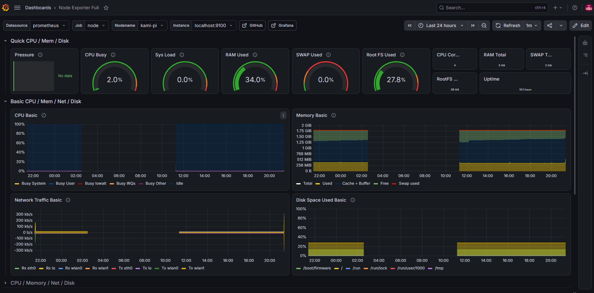
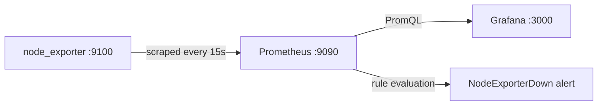

# pi-monitoring

Self-hosted monitoring stack on a Raspberry Pi 4 (2 GB): node_exporter, Prometheus and Grafana, running as hardened systemd services with a tested alert rule.



## Why this project

I wanted to learn how infrastructure monitoring works end to end: how metrics are exposed, collected, stored, visualised and alerted on. The Pi also runs my [wifi-recon](https://github.com/pauliuskunkis/wifi-recon) project, so it needed monitoring anyway, with only 2 GB RAM to share.

## How it works



- **node_exporter** reads system stats from the Pi's kernel (`/proc`, `/sys`) and serves them as plain text on `/metrics`. It stores nothing.
- **Prometheus** pulls ("scrapes") that page every 15 seconds and stores each value as a time series. Retention is capped at 15 days / 2 GB to protect the SD card.
- **Grafana** queries Prometheus and draws dashboards (Node Exporter Full, ID 1860).

## Security decisions

| Decision | Why |
|---|---|
| Every service binds to `127.0.0.1` only | Nothing is reachable from the network; I access the UIs over an SSH tunnel instead of opening ports |
| Dedicated system users with no shell or home | If a service is compromised, the attacker gets an account that can do almost nothing |
| Hardened systemd units (`NoNewPrivileges`, `ProtectSystem=strict`, `ReadWritePaths`) | Each service can only write where it must |
| Config owned by root, readable by the service | Prometheus can read its config but can't change what it scrapes or alerts on |
| Binaries verified with `sha256sum`; Grafana from its signed apt repo with `signed-by=` | Protects against tampered downloads |

## Alerting

`NodeExporterDown` fires when `up{job="node"} == 0` for 1 minute. The `for: 1m` avoids false alarms from a single failed scrape (network blip, restart).

Tested by stopping node_exporter: the alert went **Inactive → Pending (~5 s) → Firing (~1 m)** and resolved after a restart. I also killed the process with `kill -9` to confirm `Restart=on-failure` brings it back.

## Repository structure

```
systemd/                unit files for node_exporter and Prometheus
prometheus/             prometheus.yml (scrape config)
prometheus/rules/       alert rules
docs/                   screenshots
```

## Versions

node_exporter 1.12.1 · Prometheus 3.15.0 · Grafana 13.2.3 · Raspberry Pi OS Lite 64-bit

## Known limitations

- **No notifications yet.** Alerts fire in Prometheus but aren't sent anywhere (Alertmanager is next).
- **Single host.** Prometheus monitors the machine it runs on, so if the Pi dies, so does the monitoring.
- **No TLS.** Acceptable while everything is localhost-only; would be required with a remote Prometheus.
- **SD card storage.** Constant writes wear SD cards; an SSD would be better long term.
- **Grafana config is manual.** Data source and dashboard aren't provisioned from files yet.

## What I learned

- The pull model: exporters only expose data, Prometheus decides when to collect it.
- A time series is a metric name plus a unique label set. One metric can be many series.
- A gap in a graph is not a zero. It means no data was collected.
- The Pi has no hardware clock, so timestamps are only trustworthy after NTP sync.
- `/tmp` on Pi OS is RAM. Leaving downloads there cost ~350 MB of memory, which was visible on the dashboard.

## Roadmap

- [x] node_exporter, Prometheus, Grafana under systemd
- [x] Alert rule tested end to end
- [ ] Alertmanager with Discord notifications
- [ ] GitHub Actions: validate config and rules with `promtool` on every push
- [ ] Custom metric from wifi-recon (beacons per minute)
- [ ] Second scrape target (Rocky Linux VM)
